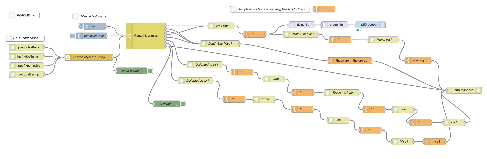

# Death Star / Battleship API lab supplement

A fun way to use Postman, the Meraki Dashboard API, and a simple Sonos HTTP API to trigger sound clips

## Parts list:

###### HW:
- Meraki MR AP's (planets in the "Meraki System")
  - use Postman to check for the presence of associated Rebel clients !
  - a sample Postman collection is included in this repo
- Raspberry Pi (or your laptop running Node-RED & Sonos HTTP API server - see below)
- Sonos Play

###### SW:
- Node-RED (http://nodered.org and great examples by Cory Guynn here: http://internetoflego.com)
- Postman (http://getpostman.com)
- Meraki Dashboard API (for Rebel client lookups)
- Sonos HTTP API - (nice & simple ! https://github.com/jishi/node-sonos-http-api)
  - local sound clips are placed in the static/clips directory
  - clip volume is set in the lib/actions/clip.js file

###### Other:
- Sound clips - find them or make your own with Audacity and Soundflower

###### How to play:

- Import the sample Node-RED flow here:
 
 *https://github.com/knakashima/death-star-api/blob/master/death-star-api-node-red-flow*

- Import the Postman collection:

 *https://github.com/knakashima/death-star-api/blob/master/DeathStar.postman_collection.json*

 - Input your own serial numbers of Meraki MR's that will be polled for Rebel clients via the Dashboard API

## Storyline:

- The Galactic Empire has tracked Rebel forces to the "Meraki System"
- Stormtroopers have secretly deployed Meraki MR's to broadcast "The Force" free wifi

1. Use Postman and the Meraki Dashboard API to search for associated Rebel clients on the MR planets
  
 *Looks like we've found a Rebel smart plug below !:*
  
  

2. After locating the Rebels, use the Death Star API (Postman) to GET/POST planet coordinates for destruction !

*For alternate sounds, use the manual test inputs (inject nodes) or send different inputs in the HTTP requests via Postman (all included in the collection)*
